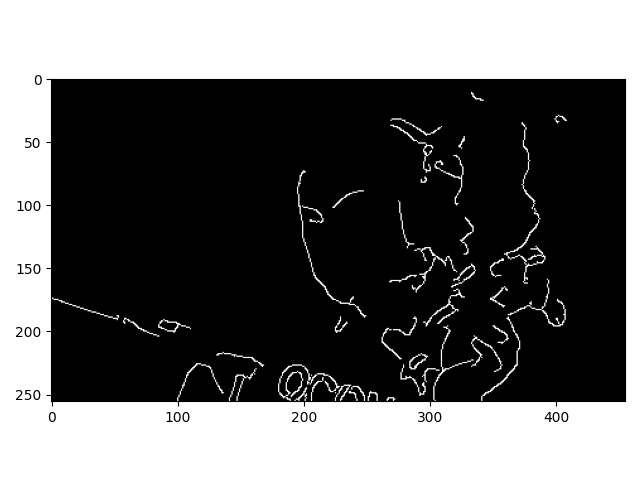
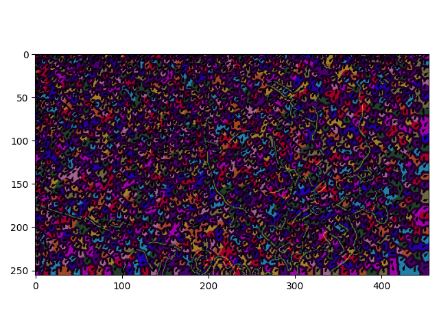
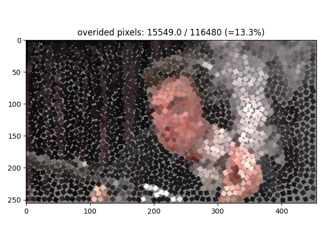

# Photo2Mosaic
Implementations and development of methods for creating a classical decorative stone mosaic from an image

# Simulating Decorative Mosaics, (Hausner 2001)
This is the first method I implemented and it works quite well.
An iterative algorithm where the image is splitted into ceteroid Vornoi cells which are pushed away from edges to 
enhance edges. oriented color squares are then palced at the center of each cell.

Input image             |  Canny edgemap
:----------------------:|:----------------:
 |  
Centroidal Vornoi diagram  |  Final mosaic
 |  

# TODO:
- Dynamic square size
- lower % tile override to 0

# Cite
Hausner, Alejo. "Simulating decorative mosaics." Proceedings of the 28th annual conference on Computer graphics and interactive techniques. 2001.

