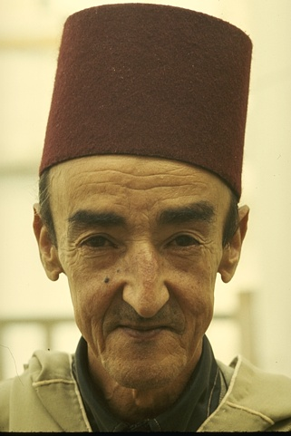
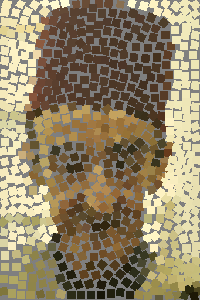
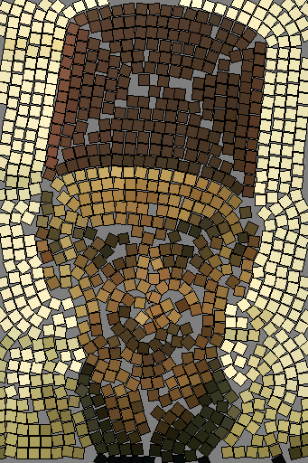
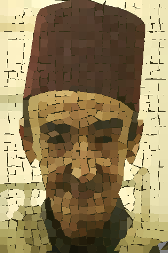
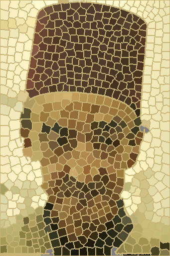
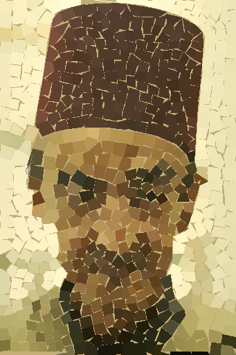
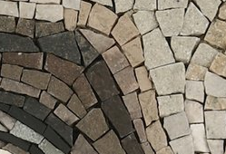
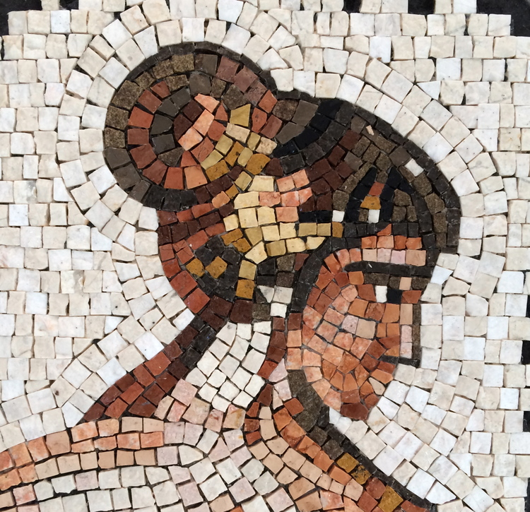
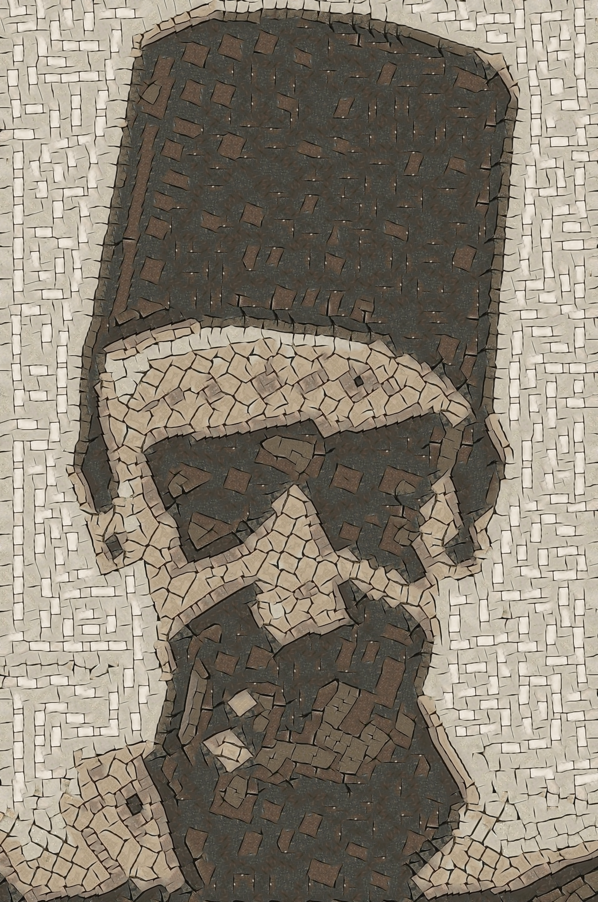
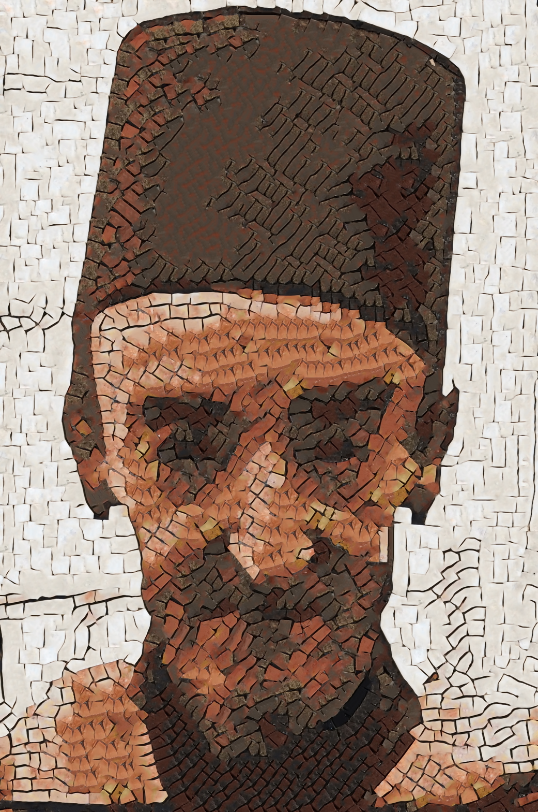

# Photo2Mosaic
Implementations and development of methods for creating a classical decorative stone mosaic from an image.
The emhphasis of the implementations here was on minimizing the use of non-square tiles so that the output can be used 
as a guidance for easy physical mosaic.

# Simulating Decorative Mosaics, (Hausner 2001)
An iterative algorithm where the image is split into ceteroid Vornoi cells which are pushed away from edges to 
enhance the effect of edges. oriented color squares are then palced at the center of each cell.


```
$ python3 Hausner2001.py data/images/turk.jpg
```

Input image             |                     Output                      
:----------------------:|:------------------------------------------------------:
 |  | 


# Artificial mosaics, (Di Blasi, Gallo 2005)
In this parallel lines to the edges are computed and tiles are put on them. 
In the original implementation tiles are overriding each other and then cut to fit the gaps. 
In this implementation the gap is not filled in order to avoid using non-square tiles.

```
$ python3 DiBlasi2005.py data/images/turk.jpg
```

Input image             |                         Output                         |
:----------------------:|:------------------------------------------------------:|
  |  


# Automated pebble mosaic stylization of images, (Doyle 2019)
This method tesselate the image into gradient oriented elipse using a variation of SLIC super pixels.
Then it smoothens the cells by cuting fourier features of the contours. Cells are then filled with underlying color 
image but with a synthetic pebble texture.

In my implementation I use regular SLIC super pixels and smooth them by approximating them by polygons which works 
better then fourier smoothing which is also available.

```
$ python3 Doyle2019.py <image path>
```

Input image             |                         Output                         |
:----------------------:|:------------------------------------------------------:|
  |  

# My method:
I combined the most sucessfull ideas from the three above methods.
The image is tessealted using edge avoiding oriented Vornoi cells like Hausner2001 but the edges are now all the level lines like in 
Di Blasi 2005. I then smoothen the cells using different methods like in Doyle 2019

```
$ python3 MyMethod.py data/images/turk.jpg
```

Input image             |                    Output  (thick contour)                    |                     Output (Polygons)                      |
:----------------------:|:-------------------------------------------------------------:|:----------------------------------------------------------:|
  |  |  |

# GPNN tiling
I used the style transfer capabilities of [GPNN](https://www.wisdom.weizmann.ac.il/~vision/gpnn/) to create a 
mosaic by tiling the input image with patches from areal mosaic


```
$ python3 GPN_tiling.py data/images/turk.jpg data/mosaics/File-4_crop.png 35 --augment_reference
```

```
$ python3 GPN_tiling.py data/images/turk.jpg data/mosaics/mosaic7.jpg 35
```

|          Input image                         |     Reference 1 (augmentation)      |                       Referenc 2                       |
:---------------------------------------------:|:--------------------------------------------------------:|:------------------------------------------------------:|
  |     |       |
|                                              |  |  |           

# Repositories credits
- https://github.com/aleenawatson/SLIC_superpixels

# Cites
```
@inproceedings{hausner2001simulating,
  title={Simulating decorative mosaics},
  author={Hausner, Alejo},
  booktitle={Proceedings of the 28th annual conference on Computer graphics and interactive techniques},
  pages={573--580},
  year={2001}
}

article{di2005artificial,
  title={Artificial mosaics},
  author={Di Blasi, Gianpiero and Gallo, Giovanni},
  journal={The Visual Computer},
  volume={21},
  number={6},
  pages={373--383},
  year={2005},
  publisher={Springer}
}

@article{doyle2019automated,
  title={Automated pebble mosaic stylization of images},
  author={Doyle, Lars and Anderson, Forest and Choy, Ehren and Mould, David},
  journal={Computational Visual Media},
  volume={5},
  number={1},
  pages={33--44},
  year={2019},
  publisher={Springer}
}

@article{achanta2012slic,
  title={SLIC superpixels compared to state-of-the-art superpixel methods},
  author={Achanta, Radhakrishna and Shaji, Appu and Smith, Kevin and Lucchi, Aurelien and Fua, Pascal and S{\"u}sstrunk, Sabine},
  journal={IEEE transactions on pattern analysis and machine intelligence},
  volume={34},
  number={11},
  pages={2274--2282},
  year={2012},
  publisher={IEEE}
}

@inproceedings{granot2022drop,
  title={Drop the gan: In defense of patches nearest neighbors as single image generative models},
  author={Granot, Niv and Feinstein, Ben and Shocher, Assaf and Bagon, Shai and Irani, Michal},
  booktitle={Proceedings of the IEEE/CVF Conference on Computer Vision and Pattern Recognition},
  pages={13460--13469},
  year={2022}
}
```