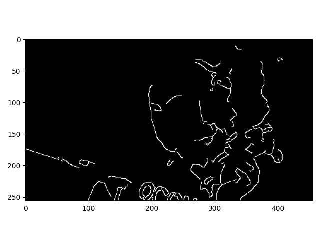
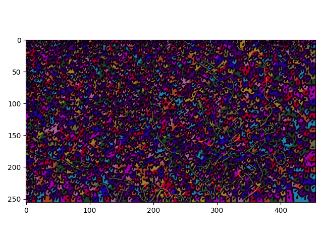
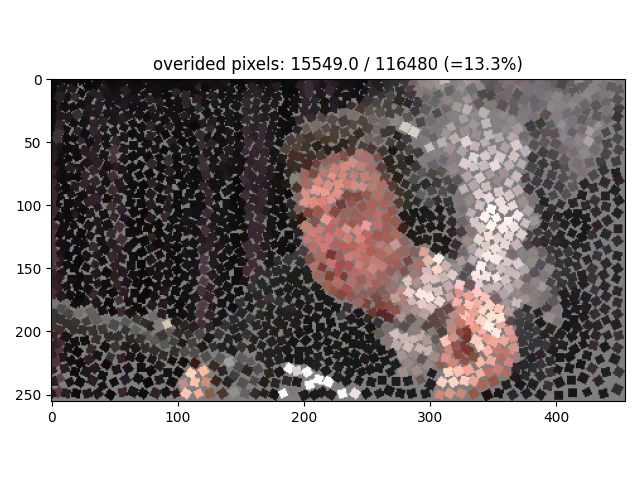
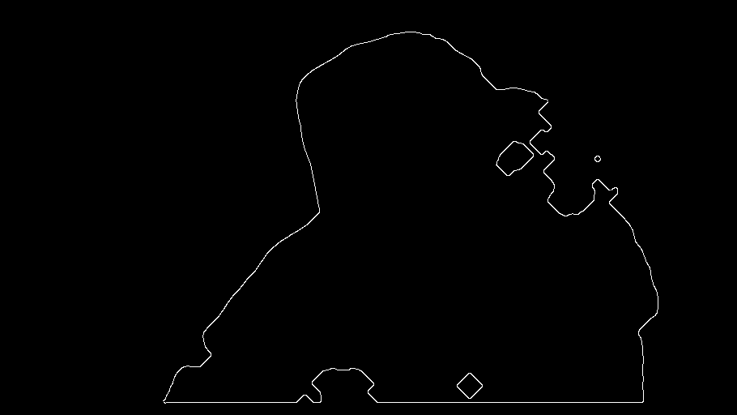
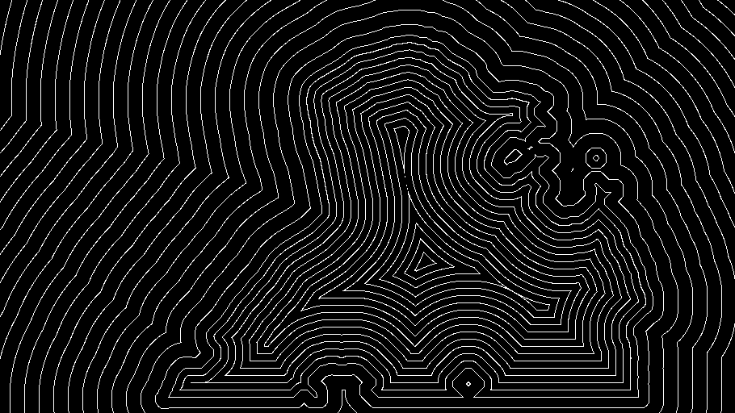
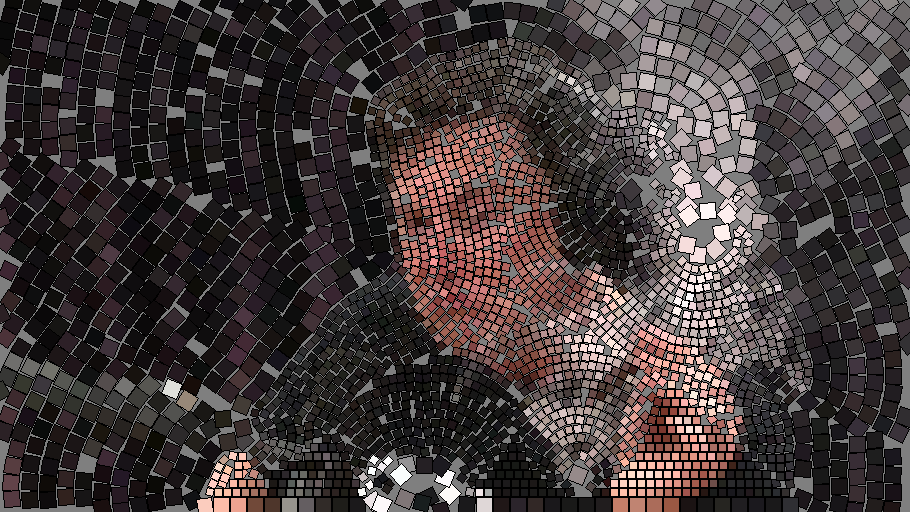

# Photo2Mosaic
Implementations and development of methods for creating a classical decorative stone mosaic from an image

# Simulating Decorative Mosaics, (Hausner 2001)
This is the first method I implemented and it works quite well.
An iterative algorithm where the image is splitted into ceteroid Vornoi cells which are pushed away from edges to 
enhance edges. oriented color squares are then palced at the center of each cell.

Input image             |  Canny edgemap
:----------------------:|:----------------:
 |  
Centroidal Vornoi diagram  |  Final mosaic
 |  

### TODO:
- Dynamic square size
- lower % tile override to 0

# Artificial mosaics, (Di Blasi, Gallo 2005)
Input image             |  Canny edgemap over binary mask
:----------------------:|:----------------:
 |  
Centroidal Vornoi diagram  |  Final mosaic Coverage: 86.3% Overlap: 4.2%
 |  

# Automated pebble mosaic stylization of images, (Doyle 2019)

### TODO:
- Cut tiles according to predefined strategy and not by order of placement
- Consider trimming tiles by the offset-levelmap

# Repositories credits
- https://github.com/aleenawatson/SLIC_superpixels

# Cite
@inproceedings{hausner2001simulating,
  title={Simulating decorative mosaics},
  author={Hausner, Alejo},
  booktitle={Proceedings of the 28th annual conference on Computer graphics and interactive techniques},
  pages={573--580},
  year={2001}
}
article{di2005artificial,
  title={Artificial mosaics},
  author={Di Blasi, Gianpiero and Gallo, Giovanni},
  journal={The Visual Computer},
  volume={21},
  number={6},
  pages={373--383},
  year={2005},
  publisher={Springer}
}

@article{doyle2019automated,
  title={Automated pebble mosaic stylization of images},
  author={Doyle, Lars and Anderson, Forest and Choy, Ehren and Mould, David},
  journal={Computational Visual Media},
  volume={5},
  number={1},
  pages={33--44},
  year={2019},
  publisher={Springer}
}